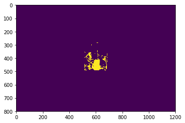
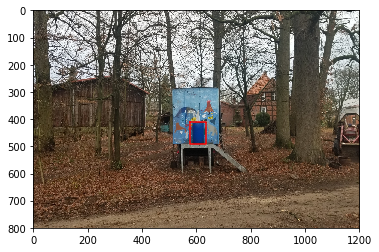

This is a color segmentation and barrel detection project.

We train two probabilistic color models from image data and use it to segment unseen images, detect a
blue barrel, and draw a bounding box around it. Two algorithms are used for this project. One is sigle Gaussian and the other is logistic regression.

Given the set of training images, you can hand-label examples of different colors by yourself using hand_label.py to circle the region of interest as training data. (But you need to download Roipoly first. URL:[https://github.com/jdoepfert/roipoly.py.git/](URL))You can also use train_b.npy and train_nb.npy as training data.

Then you can use the training files for different ways of training and see how it performs in the test images afterwards. 

This is one of the results. First one is segmentation result and the second one is detector result with bounding box.

